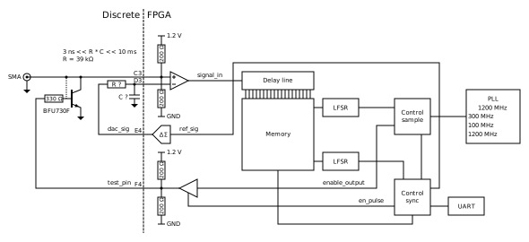
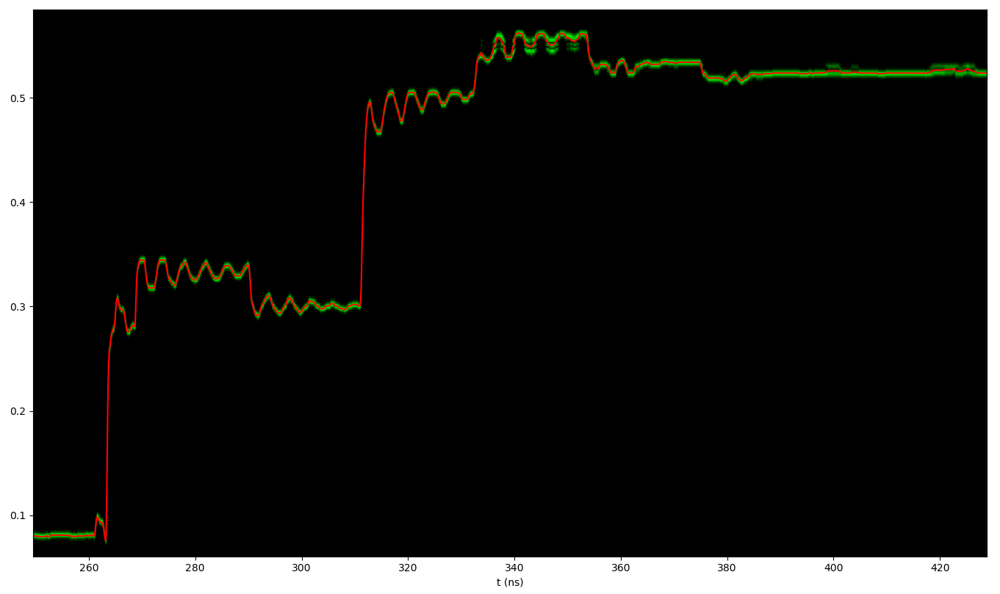

# ECP5-Scope
## WARNING: VCCIO7 needs to be 1.2 V, otherwise damage to the ECP5 may occur

This is a sampling oscilloscope based TDR for the ECP5.

It requires at least 3 passive components, but works better with one additional transistor.

Example trace:

`Gateware/Oscilloscope.py` is the gateware and `Gateware/Frontend.py` is the frontend to acquire data.